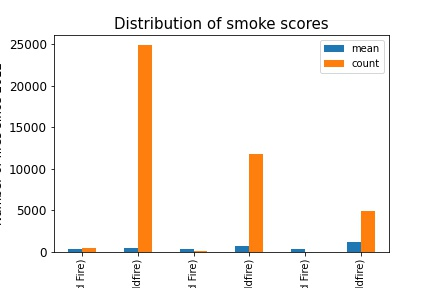
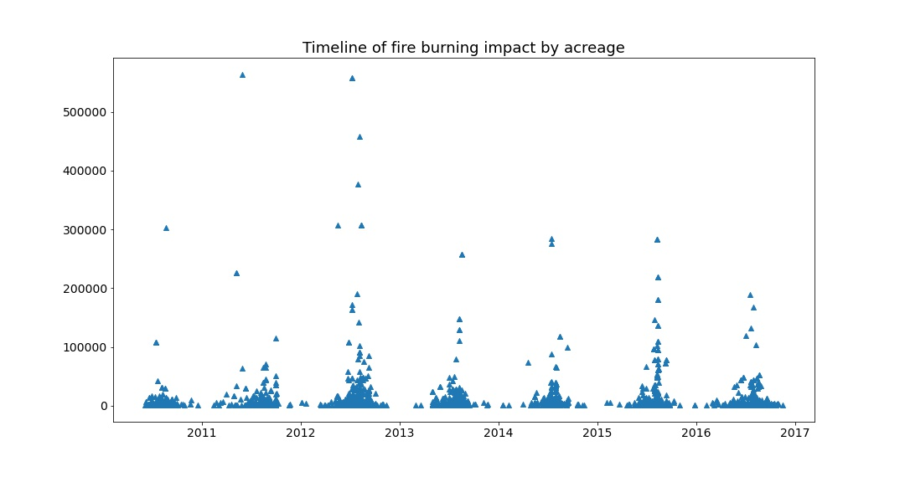

# Wildfires and Air Quality

## Problem
 

This project seeks to use pre-exisitng data to understand the relationship between wildfires and air quality by analyzing individual pollutants their respective AQIs. Maybe even PM2.5. Who knows it's not due til Friday.

 

## Team

Veronica Antonova (CA) [LinkedIn](http://linkedin.com/in/vstepanova) | [GitHub](https://github.com/cotica)

Helen Meigs (HI) [LinkedIn](https://www.linkedin.com/in/helenbm/) | [GitHub](https://github.com/welcometohelen)

Riley Robertson (WA) [LinkedIn](https://www.linkedin.com/in/riley-d-robertson/) | [GitHub](https://github.com/rileydr)

  
## Data sources

Many of these data span decades, but our timeframe of focus for this project is 2010-2017.

* [`Fire Data`](https://www.mtbs.gov/direct-download)
* [`Smoke exposure estimates from satellite imagery`](https://dataverse.harvard.edu/dataset.xhtml?persistentId=doi:10.7910/DVN/CTWGWE)
* [`Air pollutant data sourced from the EPA (preprocessed by BrendaSo, made available at kaggle.com)`](https://www.kaggle.com/sogun3/uspollution)
* [`Air Quality`](https://docs.airnowapi.org/files)
<!---* [CA EV purchases]()--->

  

## Important terminology

* AQI: air quality index; measured from Good (Green) to Hazardous (Purple).

* Prescribed fire: abbreviated 'rx'; a planned fire executed by Tribal, Federal, State, and county agencies to meet management objectives.  Rx fires are used to benefit natural resource management, get rid of excessive fuel loads before they become a bonafide wildfires, and research.

* Wildfire: an uncontrolled burn, originating in wildlands or rural areas (ie not a car burning on a Gotham street corner)

* Smoke score: a classification of light, medium, or heavy corresponding to the density of smoke coverage derived from NOAA's Hazard Mapping Systems satellite imaging (<=5%, 16%, and 27%+, respectively)

## Data acquisition and wrangling

Air quality data were scraped from the public API of the EPA's AirNow program 
Fire data were obtained from [MTBS](https://www.mtbs.gov/), "a multiagency program designed to consistently map the burn severity and perimeters of (U.S.) fires" from 1984 to present.  These fire records were combined with panelized time series summation of satellite images denoting smoke coverage down to sub-county level.

All data were cleaned and merged for processing and modeling.

  
## Data exploration

We have sought to understand some the following:

* Is there a direct relationship between AQI and fires?

* Does the type of fire (rx vs. wildfire) and/or area of burn have predictable impacts on air quality in surrounding areas?
    * if so, how long does it take for air quality to return to baseline, or at healthy 'levels of concern', as defined by the EPA?

* What fire trends can be observed over the years?

* Is there a cyclical relationship we can identify between smoke, fire and air quality?
 

Map of fires by incident type:

## Modeling techniques

  
## Key findings

* 94% of all fires are wildfires (rest are prescribed)
* California dominates both wildfire frequency and the pollution charts
* The vast majority (70%) of fires have a smoke score of 'light'

* There seems to be no relationship between the smoke score and the acreage of fire's impact (burn)
* The most massive fires, by burn acreage, in our dataset are in 2012 and 2013

  
## Recommendations and conclusions

Many factors influence air quality (_[source](https://docs.google.com/document/d/11ob6Qt6jiWdM_G-ge4UOWN0kTx-5hHZep2QBnOp1yjY/edit?usp=sharing)_). Any many unexplored features determine the intensity and impact of wildfires, such as local and global climate patterns, and vegetation type and density.  This analysis seeks to determine if wildfire type and size alone can be used to estimate air quality in nearby regions.  Fire will always happen, and this process will always release greenhouse gases and other pollutants that degrade air quality.  If the relationship between fire type, size, and air pollution is predictable, this could be extrapolated to inform an optimal controlled burn regimen that minimizes detrimental impacts on air quality and human health.  

  
## Python Notebooks and Presentation Links

* [`EDA`](./code/va-EDA.ipynb)
<!---
* [Main notebook report with findings]()
* [Scraping notebook]()
* [Modeling notebook]()
--->
* [`Slides`](https://docs.google.com/presentation/d/10I3ZuSoi1APt5GTSe4lJPC51fLsKmMWfKAVmRrd-5NY/edit#slide=id.p)

<!---

--->
  
