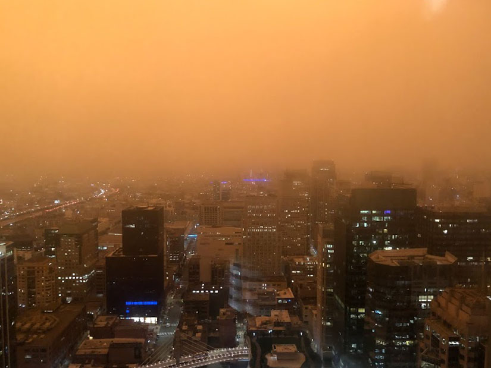

# A World With 0 Emissions

Imagine a world with no emissions. Is this even in the realm of possibility? And what does data science have to do with it?

Well, we dared to imagine.

We took data on coastal wilfires, air quality, EV production and current carbon footprint to analyze and understand the trend. Using modeling, we attempt to understand the relationship between these inputs and their weight on emissions.

- - -

## Problem Space

We are taking a regression problem and looking to predict, what carbon emissions might look like some years into the future.

## Team

Veronica Antonova (CA) [LI](http://linkedin.com/in/vstepanova)

Riley Robertson (WA) [LI](https://www.linkedin.com/in/riley-d-robertson/)

Helen Meigs (HI) [LI](https://www.linkedin.com/in/helenbm/)

- - -

## Data sources

* [Pollution - from the Environmental Dept](https://www.kaggle.com/sogun3/uspollution)
* [Fires](https://frap.fire.ca.gov/frap-projects/fire-perimeters/)
* [Air Quality](https://docs.airnowapi.org/files)
* _[CA EV purchases]()_ 

## Data acquisiton and wrangling

Data were downloaded or scraped using `beautiful soup`.

## Data exploration

- - -

## Key findings

## Recommendations

- - -

## Reports and presentation

* [Main notebook report with findings]()
* [Scraping notebook]()
* [Modeling notebook]()
* [Slides](https://docs.google.com/presentation/d/10I3ZuSoi1APt5GTSe4lJPC51fLsKmMWfKAVmRrd-5NY/edit#slide=id.p)

  
